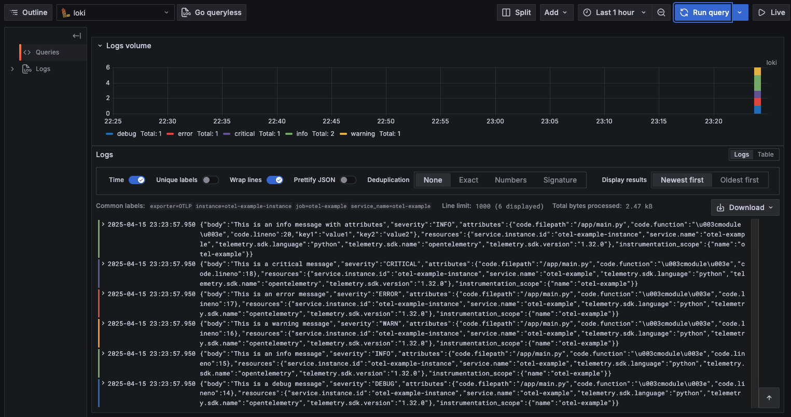

# Python OpenTelemetry Logging Example

This project demonstrates how to integrate OpenTelemetry with Python's standard logging module to export logs to an OpenTelemetry Collector, which forwards them to Grafana Loki for visualization.

## Architecture

This project implements a complete observability pipeline for logs using OpenTelemetry:

```
+-------------+       +------------------+       +------+       +---------+
| Python App  | ----> | OTel Collector   | ----> | Loki | ----> | Grafana |
| (with OTel) |       | (Logs Processor) |       |      |       |         |
+-------------+       +------------------+       +------+       +---------+
```

Components:
- **Python Application**: Uses standard Python logging with OpenTelemetry integration
- **OpenTelemetry Collector**: Receives, processes, and exports logs
- **Loki**: Log aggregation system designed for storing and querying logs
- **Grafana**: Visualization platform for monitoring and observability

## Project Structure

```
/
├── compose.yaml         # Docker Compose configuration
├── Dockerfile           # Docker configuration for the Python app
├── loki.yaml            # Grafana Loki configuration
├── main.py              # Example Python application that generates logs
├── otel-collector.yaml  # OpenTelemetry Collector configuration
├── otel_logging.py      # OpenTelemetry logging integration module
└── pyproject.toml       # Python project dependencies
```

## Requirements

- Python 3.11+
- Docker and Docker Compose
- Poetry (for dependency management)

## Setup Instructions

1. Clone this repository
2. Build and start the Docker containers:

```bash
docker-compose up -d
```

This will start:
- The Python application container
- OpenTelemetry Collector
- Loki log storage
- Grafana dashboard

3. Access Grafana at http://localhost:3000 (default credentials: admin/admin)
4. Configure Loki as a data source in Grafana:
   - Go to Configuration -> Data Sources -> Add data source
   - Select Loki
   - Set URL to http://loki:3100
   - Click "Save & Test"

## Code Explanation

### OpenTelemetry Logging Setup

The `otel_logging.py` module contains the core functionality that integrates Python's standard logging with OpenTelemetry:

```python
# Key components:
# 1. LoggerProvider - Manages the logging resources and processors
# 2. OTLPLogExporter - Exports logs to the OTel Collector via gRPC
# 3. BatchLogRecordProcessor - Batches logs for efficient export
# 4. LoggingHandler - Connects standard Python logging to OTel
```

The `setup_otel_logging` function configures:
- A LoggerProvider with service name and instance ID
- An OTLP exporter that sends logs to the collector
- A batch processor for efficient log handling
- A logging handler that's added to the root logger

### Application Code

The `main.py` file demonstrates how to use the logging integration:

1. Set up OpenTelemetry logging
2. Create a logger instance
3. Log messages at different levels
4. Include structured attributes with log messages

### OpenTelemetry Collector Configuration

The collector is configured in `otel-collector.yaml` to:
1. Receive logs via OTLP/gRPC protocol
2. Export logs to:
   - Debug output (for troubleshooting)
   - Loki storage backend

## Running the Example

1. Start the Docker environment:
   ```bash
   docker-compose up -d
   ```

2. Exec into the Python application container:
   ```bash
   docker exec -it otel-example-app bash
   ```

3. Run the example script:
   ```bash
   python main.py
   ```

4. View logs in Grafana:
   - Open http://localhost:3000
   - Navigate to Explore
   - Select Loki data source
   - Query for logs with labels like `{service_name="otel-example"}`



## Advanced Configuration

### Customizing Log Attributes

You can add contextual information to logs using the `extra` parameter:

```python
logger.info("Message with context", extra={
    "user_id": "12345",
    "request_id": "abcd-1234"
})
```

### Modifying OpenTelemetry Resource Attributes

Edit the `otel_logging.py` file to change the service information:

```python
logger_provider = LoggerProvider(
    resource=Resource.create({
        "service.name": "your-service-name",
        "service.instance.id": "instance-id",
        # Add additional resource attributes here
        "deployment.environment": "development"
    })
)
```

## Troubleshooting

Common issues:
- **Logs not appearing in Grafana**: Check OTel collector logs for connection issues
- **Connection refused errors**: Verify that all services are running and properly networked
- **Export failures**: Check that the OTel collector endpoint is correctly specified

## References

- [OpenTelemetry Python Documentation](https://opentelemetry.io/docs/instrumentation/python/)
- [Grafana Loki Documentation](https://grafana.com/docs/loki/latest/)
- [OpenTelemetry Collector Documentation](https://opentelemetry.io/docs/collector/)

